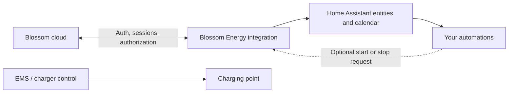

<p align="center">
  
</p>

<h1 align="center">Blossom Energy for Home Assistant</h1>

<p align="center">
  Monitor charging sessions, browse recent history and authorize home charging from Home Assistant.
</p>

<p align="center">
  <a href="https://github.com/bv2980/ha-blossom/releases/latest"></a>
  <a href="https://github.com/bv2980/ha-blossom/actions/workflows/validate.yml"></a>
  
  
</p>

> [!IMPORTANT]
> This is an unofficial community integration maintained by **bv2980**. It is not affiliated
> with or supported by Blossom. Authentication uses Blossom's web login, which is not a
> confirmed public third-party API and can change without notice.

## Highlights

- Sign in through the Home Assistant UI with your Blossom email and password.
- Select the account, home installation and charging card explicitly.
- Start and stop a home-charging session from the device page or an automation.
- Confirm commands without blindly resending them.
- Follow the active session, energy, status and charging-point state.
- Browse up to 20 recent home and public sessions in a Home Assistant calendar.
- See the last completed session's time, energy, duration, price and reimbursement.
- Change the charging card, idle refresh interval and location privacy through **Configure**.
- Receive Home Assistant repair warnings for a missing card or stale active session.
- Use English or Dutch entity and calendar text.
- Download privacy-conscious diagnostics without credentials or internal account identifiers.

## Architecture and responsibilities



The integration handles **Blossom authentication and session authorization**. It does not
control charger current, load balancing, solar charging or an energy-management system.
Vehicle recognition also belongs in your Home Assistant automation, not in this integration.

## Installation with HACS

1. Open **HACS**.
2. Open the three-dot menu and select **Custom repositories**.
3. Add `https://github.com/bv2980/ha-blossom` as type **Integration**.
4. Open **Blossom Energy** in HACS and download the latest release.
5. Restart Home Assistant Core.
6. Go to **Settings → Devices & services → Add integration**.
7. Search for **Blossom Energy** and sign in.
8. Select the matching Blossom account, home installation and charging card.

No YAML, shell commands or additional dependencies are required for installation.

### Updating

Install the update in HACS and restart Home Assistant. If HACS has not discovered a newly
published version yet, use **Update information** or **Redownload** from the HACS menu.

Users upgrading from the old v0.1.0 installation test should remove only the
**Blossom Energy — installation test** entry before adding the authenticated integration.

## Configuration options

Open **Settings → Devices & services → Blossom Energy → Configure**.

| Option | Default | Purpose |
|---|---:|---|
| Charging card | Selected during setup | Card used when Home Assistant starts home charging |
| Idle refresh interval | 15 minutes | Choose 5, 15, 30 or 60 minutes |
| Show session locations | Off | Allow returned location names in calendar and session attributes |

Changing an option reloads the entry. A different account or home installation currently
requires removing and adding the entry again. Different Blossom accounts can use separate
entries and separate token stores.

## Entities

All entities are grouped under one **Blossom home charging** service device.

### Controls

| Entity | Description |
|---|---|
| Start home charging | Starts a session with the selected Blossom card |
| Stop home charging | Stops the active home session |
| Refresh Blossom data | Requests an immediate full update |

Start is available when Blossom reports no active session. Stop is available during an
active session. After either command, the integration checks every 10 seconds for at most
one minute. It sends the command only once.

### Active session

| Entity | Description |
|---|---|
| Active Blossom session | Binary sensor intended for automations |
| Home charging session | Compatibility text sensor: `active`, `inactive`, `starting` or `stopping` |
| Active session start | Start time reported by Blossom |
| Active session energy | Current session energy in kWh |
| Active session status | Localized status such as **In progress / Bezig** |
| Last charging point update | Timestamp supplied by the active session |
| Charging point state | Localized OCPP-style state such as charging or suspended |
| Vehicle current | Vehicle current when Blossom supplies it |
| Vehicle phases | Vehicle phase count when Blossom supplies it |

`Vehicle current` and `Vehicle phases` can remain **Unknown**. Blossom includes these fields
in the response schema but does not necessarily populate them for every charger or session.
Unavailable measurements are never replaced with zero.

### Last completed session

| Entity | Description |
|---|---|
| Last completed session start/end | Final session timestamps |
| Last completed session energy | Session energy in kWh |
| Last completed session duration | Duration in minutes |
| Last completed session type | Home or public charging |
| Last completed session amount | Amount displayed by Blossom |
| Last home reimbursement | Home reimbursement when returned |

For home sessions, the displayed amount follows `hcpPrice`. For other sessions it follows
`mspPrice` plus the returned VAT percentage, using 21% only when Blossom omits VAT. Source
price details remain available as bounded attributes for verification.

### Account, history and diagnostics

| Entity | Description |
|---|---|
| Blossom account | Readable selected account or company |
| Selected charging card | Card used by Start and whether it remains available |
| Loaded recent sessions | Count and bounded summaries of at most 20 sessions |
| Available charging cards | Diagnostic count and returned card choices |
| Last charging command | Idle, pending, confirmed, rejected or confirmation failure |
| Last successful update | Time of the most recent successful cloud update |

Session history is scoped to the selected membership and installation, but it is not
filtered to the selected card. It can therefore contain both home and public sessions.

## Session calendar

The **Charging sessions / Laadsessies** calendar presents the same maximum of 20 sessions
already loaded by the coordinator. It makes no extra API calls and is not a permanent archive.

- Completed sessions use Blossom's final start and end times.
- The active session is shown as the current event.
- Home Assistant requires an end time, so an active event receives a clearly marked
  provisional end that moves forward until Blossom supplies the final end.
- Events include available energy, duration, amount, reimbursement and localized status.
- Location is included only after the location option is enabled.
- When a session falls outside Blossom's latest 20 records, it disappears from the calendar.

Open **Calendar** from the Home Assistant sidebar and select **Charging sessions**, or add a
Calendar card to a dashboard and select the calendar entity. A calendar entity is `On` only
while an event is active; `Off` does not mean that historical events are missing.

## Refresh and command strategy

| Situation | Behaviour |
|---|---|
| No active session | Configured idle interval, 15 minutes by default |
| Active Blossom session | Full update every minute |
| Immediately after Start or Stop | Active-session check every 10 seconds, for at most one minute |
| Manual refresh | Immediate full update |

Each full update validates the account and installation first. Cards, recent history and
active-session state are then fetched concurrently. A temporary failure leaves entities
unavailable rather than presenting stale data as current.

## Automation example

Vehicle detection should come from the vehicle integration. The following example starts
Blossom only on a new cable connection, when that vehicle is home and no Blossom session is
already active. Replace the entity IDs with your own.

```yaml
alias: Start Blossom charging when my car connects at home
triggers:
  - trigger: state
    entity_id: binary_sensor.my_car_charge_cable
    from: "off"
    to: "on"
conditions:
  - condition: state
    entity_id: device_tracker.my_car_location
    state: home
  - condition: state
    entity_id: binary_sensor.blossom_home_charging_active_blossom_session
    state: "off"
actions:
  - action: button.press
    target:
      entity_id: button.blossom_home_charging_start_home_charging
mode: single
```

Triggering only on the cable transition also prevents an automatic restart after a manual
stop. A new attempt requires disconnecting and reconnecting the cable.

## Repairs and troubleshooting

The integration creates a Home Assistant repair warning when:

- the selected charging card is no longer returned by Blossom;
- an active session's own last-update timestamp becomes more than 10 minutes old.

Authentication expiry starts Home Assistant's normal reauthentication flow.

| Symptom | Explanation or action |
|---|---|
| Calendar entity is `Off` | Normal when no event is active; historical sessions can still exist |
| Current or phases are `Unknown` | Blossom did not populate those optional values |
| Active values become `Unknown` after disconnecting | Expected because the active-session object no longer exists |
| Start and Stop appear as `Pressed` in Activity | Button availability changes can make the HA logbook misleading; check **Last charging command** |
| HACS still shows an older version | Use **Update information** or **Redownload**, then restart HA |
| Sign-in fails | Verify credentials on Blossom's website; MFA, CAPTCHA and social login are unsupported |
| No cards are shown | Confirm the selected account and home installation in Blossom |

When reporting a problem, include Home Assistant diagnostics and the user-visible error.
Never publish a Home Assistant backup, `.storage` files, tokens or raw account responses.

## Authentication, storage and privacy

The asynchronous client follows Blossom's Auth0 authorization-code flow with PKCE. It
validates the callback host, path and OAuth state, and sends credentials only to the
production Auth0 host. The password is discarded after login.

Access tokens remain in memory. Refresh tokens are stored locally through Home Assistant's
atomic storage helper under a separate random key per entry. Home Assistant storage is not
an encrypted vault, so protect access to Home Assistant and its backups.

The integration does not log credentials, tokens, raw responses or authentication URLs.
Diagnostics redact account, membership, company, installation, card and token-store IDs.
Deleting the config entry removes its local token store but does not revoke the Blossom login.

## Known limitations

- The web authentication and production endpoints are not a confirmed supported public API.
- MFA, CAPTCHA, Google/Apple login and other interactive sign-in methods are unsupported.
- Only the latest 20 sessions returned by Blossom are available; this is not an archive.
- Session energy sensors are per-session values, not cumulative Energy Dashboard meters.
- Session history is not filtered to the selected card.
- Vehicle current and phase information may be absent.
- The integration does not identify a vehicle or manage charging power.

## Testing and development

The repository validates every push and pull request with:

- Ruff linting and formatting;
- isolated client and data-model tests on Python 3.12;
- config flow, entities, calendar, options, reauthentication, reload and removal tests against
  Home Assistant Core 2026.9.3 on Python 3.14;
- Home Assistant Hassfest manifest and translation validation.

All automated tests use synthetic data and require no real Blossom account.

```text
api.py            Async HTTP, PKCE login and token lifecycle
models.py         Bounded validation and privacy-conscious session mapping
config_flow.py    Setup, explicit selections, options and reauthentication
coordinator.py    Shared refreshes, command confirmation and repair warnings
sensor.py         Session, account, price and diagnostic sensors
binary_sensor.py  Automation-friendly active-session state
button.py         Manual refresh and explicit charging controls
calendar.py       Localized read-only session calendar
diagnostics.py    Redacted Home Assistant diagnostics
```

## Removal

1. Remove the Blossom Energy entry under **Settings → Devices & services**.
2. Remove the integration from HACS.
3. Restart Home Assistant.

Removing the entry deletes its local token store and entities. It does not modify Blossom
cards, sessions, charger settings or energy-management configuration.

## API reference

Endpoint names were checked against the
[Blossom staging Swagger documentation](https://stg.api.blossom.be/api/docs) and the public
production web application on 2026-09-25. Runtime traffic uses production endpoints.

The icon included in this repository is an original generic charging design and is not
Blossom's company logo.
